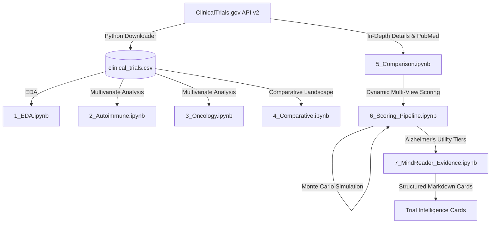

# 📋 Monthly Progress Report: June 2026
## MindReader BioTech & Clinical Trials Analytics Platform

This report compiles the work done, updates, and progress across the full-stack **MindReader BioTech** monorepo (`mindreader`) and the nested **Clinical Trials Data Analytics** repository (`dataset/`) during the month of June 2026. It highlights frontend aesthetic upgrades, authentication enhancements, advanced data pipelines, and robust DevOps operations completed by **Harsh** 

---

## Executive Summary

During June 2026, the platform underwent a major transition:
1. **Rebranding & Visual Redesign**: Evolved into **MindReader BioTech**—a premium, editorial-style biotech intelligence platform with a warm, publication-canvas look.
2. **Frictionless Security**: Adopted `Better-Auth` with Google One Tap and Chrome-compliant **FedCM** support, hardened against adblockers.
3. **Clinical Intelligence Pipeline**: Developed an automated data downloader interfacing with the modernized **ClinicalTrials.gov API v2** alongside **7 advanced Jupyter Notebooks** performing multi-perspective trial scoring, Monte Carlo rank stability, and Alzheimer's evidence parsing.
4. **DevOps & CI/CD Excellence**: Migrated from Serverless to raw Docker Compose & Caddy on AWS, separated frontend/backend CI/CD pipelines, and deployed the Next.js frontend to Vercel with clean API rewrite paths.

---

## 1. Frontend & Design System (MindReader BioTech)

The frontend styling was overhauled to reflect a world-class, premium editorial aesthetic called **MindReader BioTech**.

* **Design Tokens & Theme (`DESIGN.md`, `globals.css`)**: 
  - Adopted a warm, academic-inspired research-paper canvas (`#FFFCF5`) with high-contrast Slate typography (`#0F172A`).
  - Integrated Teal (`#0891B2`) action highlights and Emerald (`#059669`) success states.
  - Utilized modern typography (the **Geist** font family) and soft-border interactive cards.
* **Component-Level Refactoring**:
  - Implemented **full block-style resource cards** with clean, accordion-style nesting.
  - Removed old vertical line spacer clutter to maximize clean breathing space.
  - Refactored collection headers to display readable **Display Names** instead of raw slugs.
* **LinkTree Profile Update**:
  - Updated the LinkTree profile section, integrating a refined professional bio and a standardized folder structure.
* **Modern Web UX**:
  - Replaced legacy data fetching with **TanStack Query (React Query)** and integrated React **Suspense** for instant, skeletons-driven load states.

---

## 2. Better-Auth & Google One Tap Security Integration

The authentication flow was completely redesigned for maximum ease-of-use and modern compliance.

* **Transition to Better-Auth**: 
  - Integrated `better-auth` client and server plugins into the Next.js frontend and Node.js backend.
  - Mounted the better-auth middleware directly within the backend API router.
* **Google One Tap & FedCM Support**:
  - Added support for Google One Tap logins to enable zero-friction, single-click sign-ins.
  - Enabled **FedCM (Federated Credential Management)** to comply with modern Chrome cookie-blocking policies and removed start-up delays.
* **Adblocker Protection**:
  - Fixed standard adblocker rules from blocking Google Sign-In (GSI), ensuring reliable logins for users with privacy extensions enabled.
* **Production Origin Hardening**:
  - Configured verified production origins, updated CORS configs, and streamlined deep-path modal imports.

---

## 3. Clinical Trials Data Analytics (The `dataset/` Repository)

An entire scientific data pipeline was initialized and built out in a dedicated submodule.

### Python Data Scraper (`fetch_clinical_trials.py`)
- Created a robust API downloader targeting the **modernized ClinicalTrials.gov API v2**.
- Pulls up to 7,000 raw study records across two core clinical categories:
  - **Autoimmune** (Autoimmune OR Diabetes OR Arthritis)
  - **Oncology** (Oncology OR Cancer OR Leukemia OR Lymphoma OR Tumor)
- Automatically compiles structured clinical data fields into `clinical_trials.csv`.

### 7-Step Jupyter Notebook Series
1. **`1.ipynb` (Exploratory Data Analysis)**: Evaluated enrollment size distributions, trial status profiles, phase timelines, and leading industry sponsors.
2. **`2_autoimmune_deep_dive.ipynb`**: Carried out a hyper-granular multivariate analysis focusing on geographic profiles and NLP-based extraction of autoimmune trials.
3. **`3_oncology_deep_dive.ipynb`**: Conducted exhaustive parameter correlation, study durations, and enrollment distributions for oncological trials.
4. **`4_advanced_comparative_analysis.ipynb`**: Formed comparative maps contrasting Autoimmune vs. Oncology trial landscapes.
5. **`5_study_comparison.ipynb`**: Interfaced directly with API v2 to query details for targeted clinical trials, retrieving primary/secondary endpoints, linked publications (PMIDs), and results status.
6. **`6_approval_ready_dynamic_study_pipeline_scoring.ipynb`**: Translated trial raw data into robust, multi-dimensional clinical perspective scores:
   - *Investor View* (enrollment, phase, results presence).
   - *Patient View* (patient-reported outcomes and quality of life).
   - *Clinical Researcher View* (study design, blinding complexity).
   - *Regulatory View* (FDA milestones, adverse event postings).
   - *Monte Carlo Rank Stability Simulation*: Simulates rank shifts across 1,000 randomized weight variations to test confidence and feature stability.
7. **`7_mindreader_evidence_pipeline.ipynb`**: Applied this intelligence system specifically to Alzheimer's Disease trials, classifying primary endpoints into **Clinical Utility Tiers** (Tier 1: Clinical Outcomes down to Tier 4: Biomarkers).

### Pipeline Outputs (`dataset/approval_outputs/`)
- Generates fully-formed, professional **clinical trial intelligence cards** in markdown (e.g., for *Acellbia*, *Tocilizumab*, *Sarilumab*).
- Exports final study scores with confidence ratings and missing evidence matrices in CSV/JSON format.

---

## 4. Infrastructure, DevOps & CI/CD Overhaul

The entire application hosting architecture was modernized for stability and zero overhead.

* **Migration from Serverless to Raw Docker Compose + Caddy**:
  - Bypassed Dokploy to migrate the backend to a direct VPS setup managed by Docker Compose and Caddy.
  - Updated mounting paths to ensure **PostgreSQL 18 compatibility**.
  - Bypassed build-time Prisma verification check constraints by injecting dummy database credentials during Docker image builds.
* **Caddy Routing Refinement**:
  - Rewrote the `Caddyfile` with mutually exclusive matching rules and handle blocks.
  - Prevented double-rewriting on reverse proxy paths and ensured `Better-Auth` endpoints are correctly routed.
* **CI/CD Build Tags Split**:
  - Separated GitHub Actions deployment workflows into independent frontend and backend pipelines.
  - Isolated build triggers so that changes to root or workspace config files only build the affected services, saving CI runtime.
* **Vercel Frontend Optimization**:
  - Shifted frontend hosting to Vercel and optimized the `next.config.js` with robust API path rewrites to prevent double-prefix issues.

---

## 6. Next Steps
- Add more data source, and interlink them
- Validate all the trial comparision
- validate the scoring and normalization algorithms
- we have to figure a way from that i can link python and the node js server so that we can fetch the data dynamically
- we should have an interactive ui for the comparison